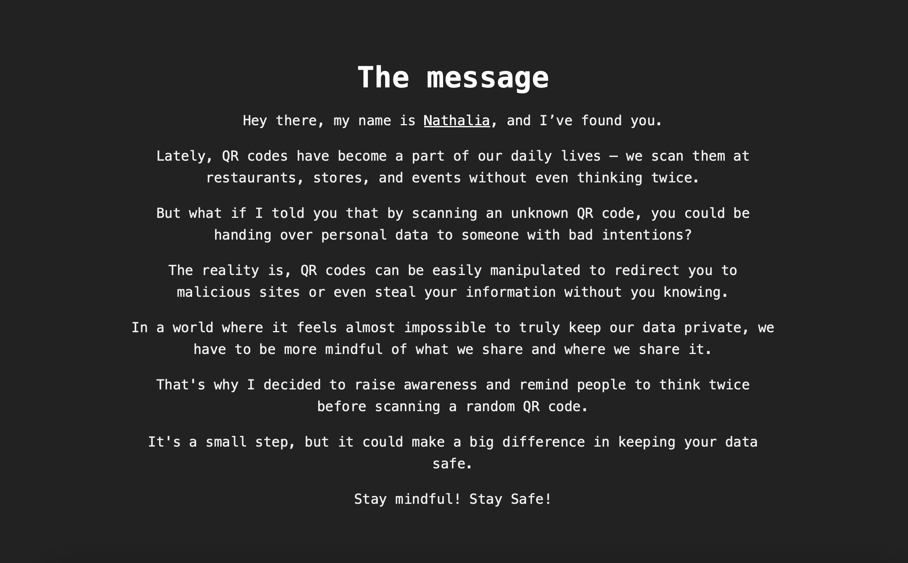

# Raising awareness💡

#### About the project

 A QR code that can be found around places to conscientize people to be mindful before scanning a unknown qr code on the street.

When the QR code is scanned, the person will be redirected to the [page](https://rellumgeluk.github.io/madeyouscan/) and in this [page](https://rellumgeluk.github.io/madeyouscan/) they will receive a message informed that they have been hacked. However, the next message will inform that this is nothing more than a joke and will warn the person to don't go around scanning random qr codes.
Additionally, on the right bottom part this page, they will be able to check for further information about it. Which leads to the [message page](https://rellumgeluk.github.io/madeyouscan/themessage.html). 
